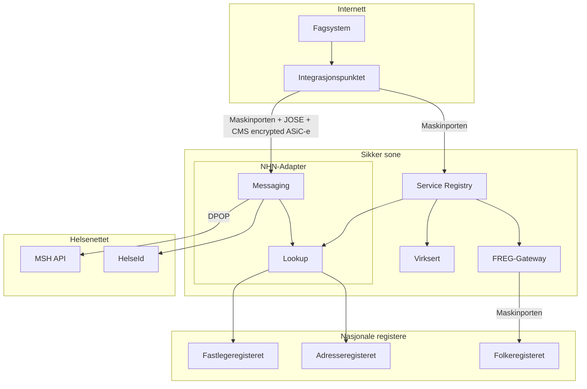
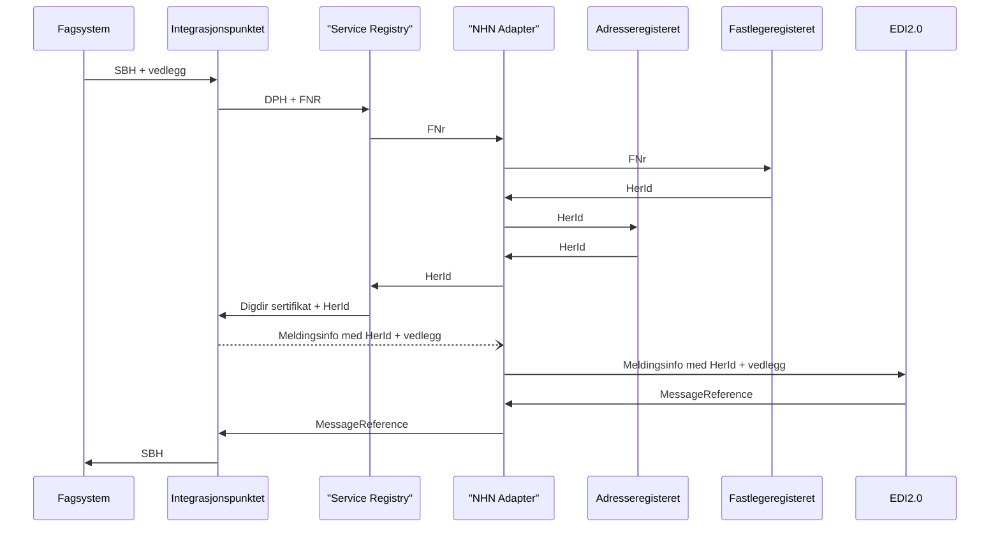
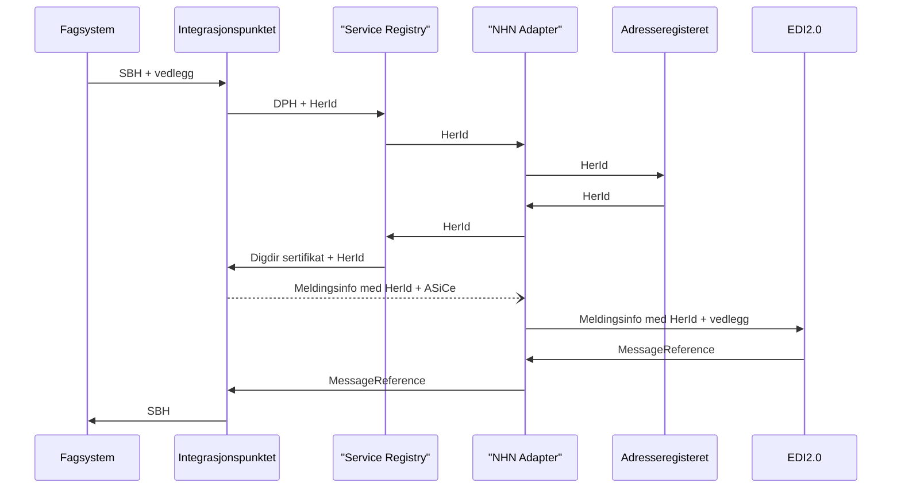
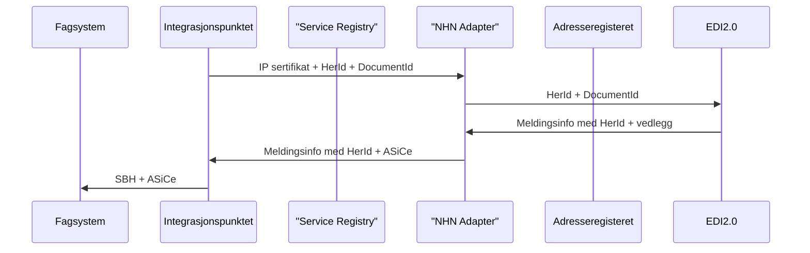

# efm-nhn-adapter

# Dette er ein test

efm-nhn-adapter er eit adapter for sending og mottak av meldingar via Norsk Helsenett si meldingsteneste (DPH) frå [eFormidling](https://github.com/digdir/efm-integrasjonspunkt).

Adapteret skal handtere blant anna:

- Autentisering via HelseID
- Adressering til fastlege basert på fødselsnummer
- Adressering til helseaktør via HER-id
- Sending av meldingar via NHN sitt REST-API
- Handsaming av kvitteringar og eventuelle svarmeldingar

Det er planlagt at adapteret skal byggje på eit bibliotek utvikla av KS Digital. Dette biblioteket er førebels ikkje tilgjengeleg, så det vert nytta mockar/stubbar der det er nødvendig.

## Teknologi

- Java 25
- Maven
- JUnit 5

## Systemskisse

## Caser
 
### Case 1 - Sending til fastlege med FNR

### Case 2 - Sending til fastlege med HerId

### Case 3 - Sending fra fastlege

